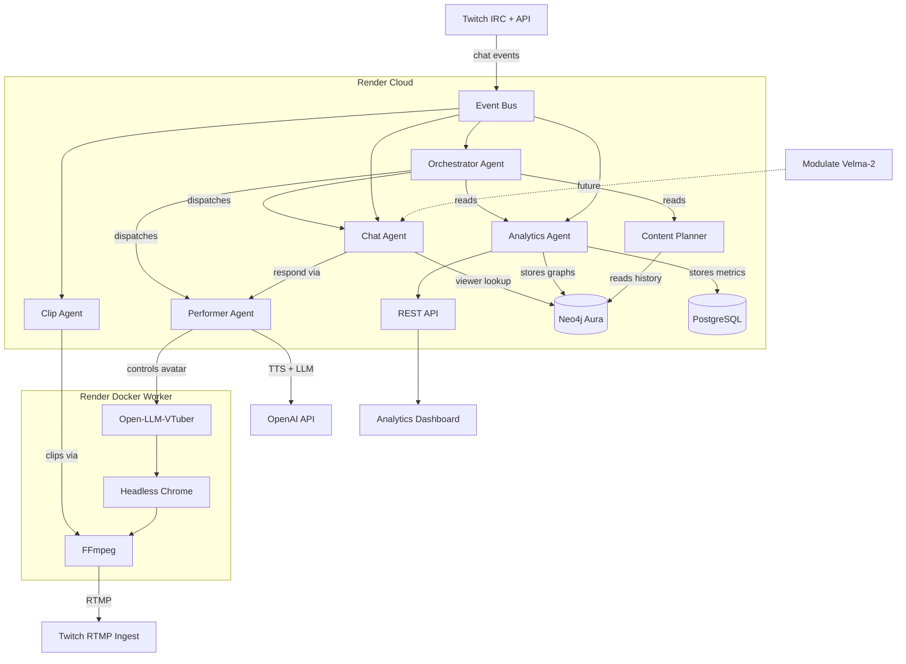

# Autonomous Revenue-Optimized VTuber Agent

## Technology Stack

- **Base framework**: Open-LLM-VTuber (Live2D avatar + WebSocket architecture)
- **Orchestration**: Claude Agent SDK (`claude-agent-sdk` Python package) -- subagents via `ClaudeSDKClient` + custom MCP tools
- **LLM**: OpenAI GPT-4o (conversation, personality)
- **TTS**: OpenAI TTS API (voice synthesis)
- **STT / Emotion**: Modulate Velma-2 API (integrated but usage deferred)
- **Memory**: Neo4j Aura (knowledge graph) + vector embeddings for semantic recall
- **Streaming pipeline**: Headless Chrome + FFmpeg to Twitch RTMP (inspired by `smallbraineng/webstreamer`)
- **Hosting**: Render (Docker background workers for agents, web service for dashboard)
- **Persona**: Anime-style female VTuber

---

## Manual Steps (You Must Do Yourself)

These cannot be automated and must be done before/during development:

1. **Twitch Developer App** -- You said you have credentials. Ensure you have: Client ID, Client Secret, OAuth token (with `chat:read`, `chat:edit`, `channel:read:subscriptions`, `bits:read` scopes), and your channel name.
2. **OpenAI API Key** -- Create at platform.openai.com. You need access to Chat Completions (GPT-4o) and Audio/TTS endpoints.
3. **Anthropic API Key** -- For Claude Agent SDK. Create at console.anthropic.com.
4. **Modulate API Key** -- Sign up at modulate-developer-apis.com, create an API key from the dashboard.
5. **Neo4j Aura Account** -- Create free instance at neo4j.com/cloud/aura-free. Save the connection URI, username, and password.
6. **Render Account** -- Sign up at render.com. Link your GitHub repo for auto-deploys.
7. **Live2D Model** -- Acquire or commission an anime female Live2D model (Cubism 3-5 format). Open-LLM-VTuber ships with a default model for testing, but you'll want a custom one for branding.
8. **Analytics Dashboard Frontend** -- You noted you'll plan this yourself. The backend will expose metrics via API endpoints that you can consume.

---

## Phase 1: Working Avatar + Voice + Twitch Chat (MVP)

**Goal**: A Live2D VTuber that runs in headless Chrome, reads Twitch chat, responds with GPT-4o, speaks with OpenAI TTS, and streams to Twitch via FFmpeg. No multi-agent yet -- single process, get it working end-to-end.

### 1.1 -- Set up Open-LLM-VTuber locally

- Clone the Open-LLM-VTuber repo into the project
- Configure `conf.yaml`:
  - `llm_provider: openai_llm` with GPT-4o model
  - `tts_model:` use OpenAI-compatible TTS (Open-LLM-VTuber supports OpenAI-compatible endpoints)
  - `system_config.enable_proxy: true` (needed for external chat forwarding)
- Install dependencies (`uv` or `pip`)
- Verify the avatar renders and speaks in the browser at `localhost:12393`

### 1.2 -- Build Twitch Chat Client

- Create a standalone Python service (`twitch_client/`) that:
  - Connects to Twitch IRC via `twitchio` library
  - Listens for chat messages, subscriptions, bits, raids
  - Forwards messages to Open-LLM-VTuber's `/proxy-ws` WebSocket endpoint
  - Prioritizes messages: donations/bits > subs > mods > regular chat
- This follows the Open-LLM-VTuber "Live Platform Client" architecture (separate process that talks to the proxy endpoint)

### 1.3 -- Build Streaming Pipeline (webstreamer-inspired)

- Create a Rust or Python service (`streamer/`) inspired by `smallbraineng/webstreamer`:
  - Launch headless Chrome (via Puppeteer/Playwright) pointing at the Open-LLM-VTuber frontend URL
  - Load a Chrome extension that captures tab audio + video using `chrome.tabCapture` API
  - Pipe the captured media to FFmpeg
  - FFmpeg encodes to H.264/AAC and pushes to Twitch RTMP ingest URL
- Alternative simpler approach for Phase 1: use `playwright` + `ffmpeg` screen capture of the browser window (lower quality but faster to build)

### 1.4 -- Persona & Personality

- Write the VTuber's character bible as a system prompt document:
  - Name, backstory, personality traits, speech patterns, catchphrases
  - Rules (what she will/won't talk about, tone guidelines)
  - Twitch-specific behavior (how to react to follows, subs, raids, bits)
- Store in `persona/character.md`, loaded into the LLM system prompt

### 1.5 -- End-to-end integration test

- Start all 3 processes: Open-LLM-VTuber backend, Twitch client, streaming pipeline
- Send test messages in Twitch chat
- Verify: message appears -> LLM generates response -> TTS speaks -> avatar lip-syncs -> stream shows on Twitch
- Target latency: under 3 seconds from chat message to spoken response on stream

---

## Phase 2: Multi-Agent Orchestration with Claude Agent SDK

**Goal**: Decompose the monolith into specialized agents coordinated by an Orchestrator. Each agent is a Claude Agent SDK subagent with custom MCP tools.

### 2.1 -- Orchestrator Agent (the "director")

- Create `agents/orchestrator.py` using `ClaudeSDKClient`
- Define custom MCP tools using `@tool()` decorator:
  - `get_stream_state()` -- returns current viewer count, chat velocity, donation rate, current activity
  - `set_activity(activity)` -- tells the Performer agent what to do (talk, react, sing, etc.)
  - `send_chat_response(message, priority)` -- dispatches a response to Twitch chat
  - `get_analytics_summary()` -- pulls latest metrics from the Analytics agent
- The Orchestrator runs a loop: observe state -> decide action -> dispatch to subagents
- Uses `ClaudeAgentOptions(system_prompt=...)` with a strategic system prompt focused on engagement and revenue

### 2.2 -- Performer Agent (voice + avatar control)

- Create `agents/performer.py`
- MCP tools:
  - `speak(text, emotion)` -- sends text to OpenAI TTS with emotion-appropriate voice parameters, forwards audio to Open-LLM-VTuber frontend
  - `set_expression(expression)` -- changes Live2D model expression (happy, sad, surprised, angry, etc.)
  - `set_motion(motion)` -- triggers a Live2D motion (wave, nod, idle variations)
- Wraps the Open-LLM-VTuber WebSocket API to control the avatar programmatically
- Maintains emotional state that influences voice tone and expressions

### 2.3 -- Chat Agent (chat triage + response)

- Create `agents/chat_agent.py`
- Replaces the simple forwarding from Phase 1 with intelligent triage:
  - Classifies incoming messages by type (donation, sub, raid, question, greeting, spam)
  - Ranks by monetization value (bits/donation amount > sub tier > regular)
  - Generates personalized responses for donors (uses viewer history from Neo4j)
  - Batches regular chat for summary responses ("chat is saying...")
- MCP tools:
  - `read_chat(count)` -- gets latest N messages from chat queue
  - `lookup_viewer(username)` -- queries Neo4j for viewer history, donation total, first seen date
  - `respond_to_chat(message, target_user)` -- sends response via Performer agent

### 2.4 -- Analytics Agent (metrics collector)

- Create `agents/analytics.py`
- Runs as a background data collector (not a Claude agent -- pure Python):
  - Polls Twitch API for viewer count, follower count, sub count every 30s
  - Tracks chat messages per minute (velocity)
  - Tracks donations per hour, average donation size
  - Computes engagement score: `chat_velocity * viewer_retention * donation_rate`
  - Stores time-series data in a local SQLite or PostgreSQL on Render
- Exposes metrics via REST API for the Orchestrator and your analytics dashboard

### 2.5 -- Integrate Modulate Velma-2 API (placeholder)

- Create `integrations/modulate.py` with a thin wrapper around the Velma-2 batch and streaming APIs
- Wire up authentication with your API key
- No active usage yet -- the module is ready for Phase 3 when you decide how to use emotion detection

### 2.6 -- Agent communication bus

- Build an event bus (`core/event_bus.py`) using Python `asyncio.Queue` or Redis pub/sub:
  - Events: `chat_message`, `donation`, `sub`, `raid`, `viewer_count_update`, `engagement_alert`
  - Orchestrator subscribes to all events
  - Subagents publish/subscribe to relevant events
- This decouples agents so they can be developed and scaled independently

---

## Phase 3: Monetization Optimization

**Goal**: The system actively optimizes for revenue. Track what works, do more of it.

### 3.1 -- Neo4j Knowledge Graph for Viewer Relationships

- Schema design:
  - `(:Viewer {username, first_seen, total_donated, sub_tier, message_count})`
  - `(:Stream {id, date, duration, total_revenue, peak_viewers})`
  - `(:Topic {name, category})`
  - Relationships: `(:Viewer)-[:DONATED {amount, timestamp}]->(:Stream)`, `(:Viewer)-[:CHATTED_DURING]->(:Stream)`, `(:Stream)-[:DISCUSSED]->(:Topic)`
- Populate from Analytics Agent data after each stream
- Chat Agent queries Neo4j to personalize donor interactions ("Welcome back! Last time you were here we talked about...")

### 3.2 -- Donation Response System

- Enhance the Chat Agent with donation-specific behavior:
  - Immediate verbal acknowledgment of any donation (name + amount + personalized thanks)
  - Tiered reactions: small donation = thank you, medium = special expression/motion, large = dedicated segment
  - Donation goals: "If we hit $X I'll [do something fun]" -- Orchestrator tracks progress and announces milestones
- Track which response styles correlate with follow-up donations (store in Neo4j)

### 3.3 -- Engagement-Revenue Optimization Loop

- The Orchestrator implements a contextual bandit:
  - Actions: topic selection, interaction frequency, response style, donation prompt timing
  - Reward signal: `donations_per_hour + sub_conversions * 5 + viewer_retention_rate * weight`
  - Uses Thompson Sampling or epsilon-greedy for exploration
- After each stream, the Analytics Agent generates a report:
  - Revenue breakdown by hour
  - Which topics/activities correlated with highest donation rates
  - Viewer retention curves
  - Recommendations for next stream
- Store decisions and outcomes in Neo4j for long-term learning

### 3.4 -- Subscriber Engagement

- Track subscriber retention (who renewed, who churned)
- Chat Agent gives subscribers special treatment (faster responses, uses their name more often)
- Orchestrator schedules "subscriber appreciation" segments during streams

### 3.5 -- Revenue API Endpoints

- Expose REST endpoints for your analytics dashboard:
  - `GET /api/revenue/summary` -- total revenue, breakdown by source
  - `GET /api/revenue/timeline` -- revenue over time
  - `GET /api/viewers/top` -- top donors, most active chatters
  - `GET /api/streams/history` -- past streams with metrics
  - `GET /api/optimization/report` -- latest bandit decisions and outcomes

---

## Phase 4: Content Planning & Auto-Editing

**Goal**: The VTuber plans its own content schedule and automatically creates clips for cross-platform growth.

### 4.1 -- Content Planner Agent

- Create `agents/content_planner.py` as a Claude Agent SDK subagent
- MCP tools:
  - `get_trending_topics()` -- scrapes trending topics from Twitter/X, Reddit, YouTube trending
  - `get_stream_history()` -- queries Neo4j for past stream performance by topic
  - `get_audience_timezone()` -- analyzes viewer activity patterns for optimal scheduling
  - `create_schedule(days)` -- generates a stream schedule for the next N days
- Outputs a schedule with: time, content type (talk, react, challenge, Q&A), topic, expected engagement
- Orchestrator consumes the schedule at stream start to guide the session

### 4.2 -- Clip/Highlight Agent

- Create `agents/clip_agent.py`
- Monitors stream in real-time for "clip-worthy" moments:
  - Chat velocity spikes (everyone typing at once)
  - Large donations or raids
  - Emotional peaks (detected via Modulate emotion analysis on the VTuber's own audio, or chat sentiment)
- When a moment is detected:
  - Extract the last 30-60 seconds of stream video via FFmpeg
  - Generate a title and description using the LLM
  - Auto-caption using Whisper or Modulate Velma-2 transcription
  - Queue for upload to YouTube Shorts / TikTok (via their APIs)

### 4.3 -- Cross-Platform Posting

- Build `integrations/social.py`:
  - YouTube Data API for uploading Shorts
  - TikTok Content Posting API for uploading clips
  - Twitter/X API for posting stream announcements and clip links
- Content Planner Agent schedules posts: pre-stream hype, mid-stream clips, post-stream highlights

### 4.4 -- Long-Term Memory & Self-Improvement

- Neo4j stores the VTuber's evolving knowledge:
  - Topics discussed and audience reception
  - Jokes that landed vs. fell flat
  - Viewer preferences and recurring topics
  - Seasonal patterns (holidays, game releases, events)
- After every stream, run a "retrospective" agent that:
  - Analyzes the stream's Neo4j data
  - Updates the persona's system prompt with learned preferences
  - Adjusts the bandit model weights
  - Generates a "lessons learned" node in the graph

---

## Architecture Diagram

